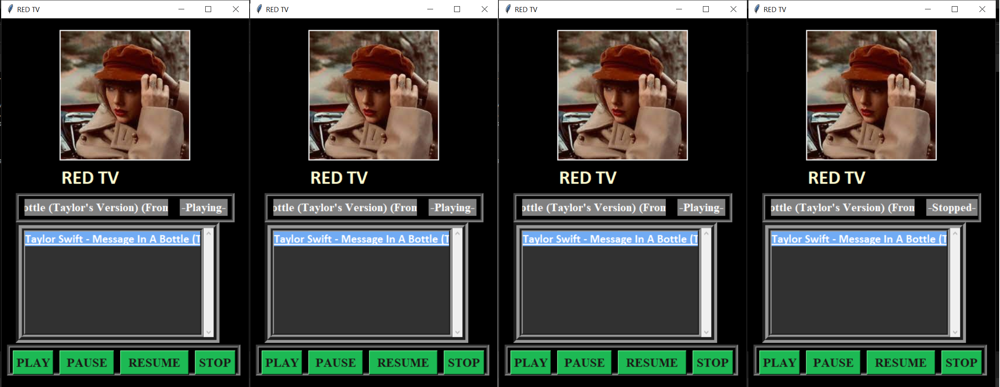

# Taylor_World_Music_Player

In this project, I'm using Socket Programming to make a music player, that allows the client to choose and play the desired song from the server. I've inlcuded my favourite Taylor Swift albums to choose from and it also allows the client to make a custom playlist from these available songs. 

I've used TCP connection to implement the transfer of selected song from server to client.

## Pre-requisites:
- Install and import pydub package for audio playback and related function -> pip install pydub
- Import tkinter for GUI (all import statements available in code)
- Install and import PIL for image management in the GUI -> pip install pillow
- Install and import pygame for sound functionalities ->pip install pygame

## Functions involved and their gist
(Every segment of code is explained via comment lines in the code)

### Server side functions:
- Serverconn(): Get album name from client and send songs from that directory
- PlayPlaylist(): Send songs from All songs directory to client based on chosen songs
- Playlist(): Sending list of available songs to client to make playlist
- main function: Used to call desired functions based on client request

### Client side functions:
(Every segment of code is explained via comment lines in the code)
- PlayCustomPlaylist(): Contains GUI for playing custom gui songs and retrieves song from server
- CustomPlaylist(): GUI to create custom playlists 
- Album(): Main window containing albums to play and options to start the other 2 functions
- Opengui(functions): Send necessary arguments to Album() based on album clicked

## Operations
- Click on the song present in the listbox, and then click play to start playing the song
- Click on other buttons like pause/resume to do their resp. functions
- Before closing the window, click on the stop button to unload song properly 
- To add songs to the custom playlist, click on the songs desired from the Song Directory listbox and click ADD.
- Once the playlist is created click DONE to close window, your playlist will be available on the Play Custom Playlist window
- To play custom playlist, click on Play Custom Playlist and follow the above functionalities to play songs 

## Points to note
- I haven't included all the songs from Taylor's mentioned albums as this project was mainly focused on socket implementation. Feel free to add songs as per wish.
- Wait for windows to load, there might be a slight delay due to command line print statements.

## Things to improve
- I agree this is a major drawback, but only one song can be played from chosen album, to play another from the same album or playlist you must reopen the window. I'm working on it to change that and it would be much appreciated if anyone could help with that

## Screenshots
- Albums GUI
  
- Play songs
  
- Custom Playlist Creation
  
- Play custom playlist
  
   

## Resources
- The GUI and song functionalities were inspired from [here](https://www.studytonight.com/tkinter/music-player-application-using-tkinter), I have also reused the code and applied to my project with some changes.
